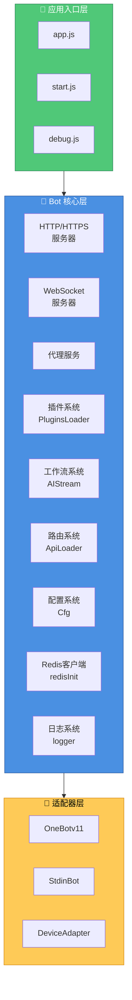
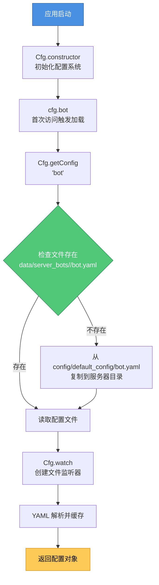
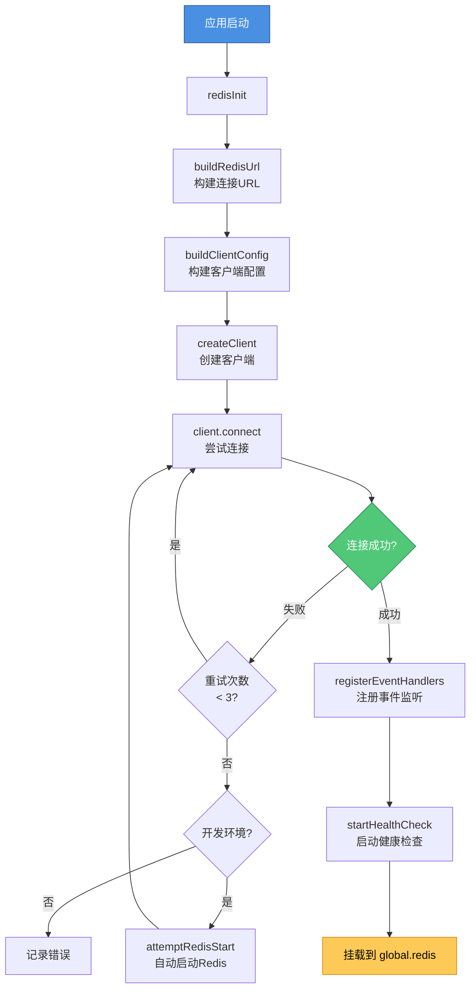
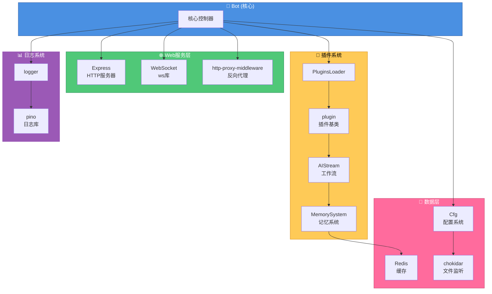

<h1 align="center">XRK-Yunzai 技术架构文档</h1>

<div align="center">


</div>

> 🏗️ 本文档详细说明 XRK-Yunzai 的技术栈架构、核心对象的作用与特性，以及它们在整个系统中的位置和关系。

---

<h2 align="center">1. 系统架构概览</h2>

XRK-Yunzai 采用 **事件驱动、模块化** 的架构设计，核心组件包括：



---

<h2 align="center">2. 核心对象与技术特性</h2>

### 2.1 Bot 对象 (`lib/bot.js`)

**作用**: 系统的核心控制器，负责整个应用的生命周期管理。

**技术特性**:
- **继承 EventEmitter**: 支持事件驱动架构
- **Proxy 机制**: 将 `BotUtil` 的方法代理到 `Bot` 实例
- **多服务器支持**: 支持 HTTP、HTTPS、反向代理同时运行
- **WebSocket 支持**: 统一的 WebSocket 升级处理
- **中间件系统**: Express 中间件（压缩、安全、限流、认证）
- **静态资源服务**: 内置静态文件服务
- **健康检查**: 提供 `/status` 和 `/health` 端点

**在技术栈中的作用**:
1. **服务生命周期管理**: 启动、关闭 HTTP/HTTPS/代理服务器
2. **事件分发中心**: 通过 `em()` 方法分发事件到插件系统
3. **适配器集成点**: 适配器通过 `Bot.adapter.push()` 注册，通过 `Bot.em()` 触发事件
4. **路由注册点**: API 路由通过 `ApiLoader.register(app, bot)` 注册
5. **工具函数提供者**: 通过 Proxy 提供 `BotUtil` 的所有工具函数

**关键方法**:
- `run(options)`: 启动服务器
- `prepareEvent(data)`: 准备事件对象，注入 Bot 实例和联系人对象
- `_extendEventMethods(data)`: 扩展事件对象的方法（sendFile、makeForwardMsg等）
- `em(name, data)`: 触发事件（支持事件名层级传播）
- `closeServer()`: 优雅关闭服务器

---

### 2.2 事件对象 `e`

**作用**: 统一的事件数据结构，无论事件来源（OneBot、设备、STDIN），都使用相同的结构。

**技术特性**:
- **统一接口**: 所有事件源都转换为相同的对象结构
- **自动增强**: 通过 `Bot.prepareEvent()` 和 `PluginsLoader.dealMsg()` 自动注入属性和方法
- **类型标识**: 自动设置 `isGroup`、`isPrivate`、`isDevice`、`isStdin`、`isMaster` 等标识
- **联系人对象**: 自动注入 `friend`、`group`、`member` 对象（如果存在）
- **方法注入**: 自动注入 `sendFile`、`makeForwardMsg`、`getInfo` 等方法

**在技术栈中的作用**:
1. **插件输入**: 所有插件方法都接收事件对象 `e` 作为参数
2. **上下文传递**: 携带完整的消息、发送者、群组等信息
3. **统一回复接口**: 通过 `e.reply()` 统一处理消息回复
4. **权限判断**: 通过 `e.isMaster` 等属性进行权限判断
5. **日志标识**: 通过 `e.logText` 和 `e.logFnc` 统一日志格式

**创建流程**:
```
适配器/API → Bot.em() → Bot.prepareEvent() → PluginsLoader.deal() 
→ PluginsLoader.dealMsg() → 事件对象 e（完整）
```

**关键属性**:
- `e.bot`: Bot 子实例
- `e.message`: 原始消息数组
- `e.msg`: 消息文本内容
- `e.friend`/`e.group`/`e.member`: 联系人对象
- `e.reply()`: 回复方法
- `e.isGroup`/`e.isPrivate`/`e.isMaster`: 类型标识

---

### 2.3 配置对象 `cfg` (`lib/config/config.js`)

**作用**: 统一的配置管理系统，支持多端口隔离、热更新。

**技术特性**:
- **单例模式**: 全局唯一的配置实例
- **多端口隔离**: 通过端口号隔离不同服务器的配置
- **热更新**: 使用 `chokidar` 监听文件变更，自动清除缓存
- **配置合并**: 默认配置 + 服务器配置，服务器配置优先
- **懒加载**: 配置按需加载，首次访问时读取文件
- **类型转换**: 自动处理 YAML 到 JavaScript 对象的转换

**在技术栈中的作用**:
1. **配置提供者**: 所有模块通过 `cfg` 获取配置
2. **动态配置**: 支持运行时修改配置（通过 `setConfig()`）
3. **配置隔离**: 多实例部署时配置互不干扰
4. **配置验证**: 通过默认配置确保必要字段存在

**关键方法**:
- `cfg.bot`: 获取机器人配置
- `cfg.redis`: 获取 Redis 配置
- `cfg.getGroup(groupId)`: 获取群组配置
- `cfg.setConfig(name, data)`: 保存配置
- `cfg.masterQQ`: 获取主人QQ列表

---

### 2.4 Redis 客户端 (`lib/config/redis.js`)

**作用**: 提供高性能的缓存和存储服务。

**技术特性**:
- **连接池**: 根据系统资源自动调整连接池大小
- **自动重连**: 指数退避重连策略
- **健康检查**: 定期 PING 检查连接状态
- **开发友好**: 开发环境自动尝试启动 Redis 服务
- **全局访问**: 初始化后挂载到 `global.redis`

**在技术栈中的作用**:
1. **AI 记忆系统**: 存储长短期记忆（ZSet + JSON）
2. **语义检索索引**: 持久化存储历史对话文本，供 BM25 检索使用
3. **速率限制**: 存储 API 调用频率限制数据
4. **会话锁**: 防止并发执行同一会话
5. **消息缓存**: 缓存历史消息

**关键功能**:
- `redisInit()`: 初始化连接
- `closeRedis()`: 优雅关闭
- `getRedisClient()`: 获取客户端实例

---

### 2.5 日志对象 `logger` (`lib/config/log.js`)

**作用**: 提供统一的日志记录和格式化功能。

**技术特性**:
- **基于 Pino**: 高性能日志库
- **多级别日志**: trace/debug/info/warn/error/fatal
- **文件轮转**: 按天轮转，自动压缩
- **自动清理**: 定时清理过期日志
- **颜色支持**: 丰富的颜色和格式化工具
- **性能优化**: 异步写入，不阻塞主线程

**在技术栈中的作用**:
1. **统一日志格式**: 所有模块使用相同的日志接口
2. **调试支持**: trace 日志记录详细执行流程
3. **错误追踪**: error 日志记录异常堆栈
4. **性能监控**: 通过日志分析性能瓶颈

**关键方法**:
- `logger.info/warn/error()`: 基础日志方法
- `logger.time/timeEnd()`: 性能计时
- `logger.json/table()`: 数据格式化
- `logger.cleanLogs()`: 清理过期日志

---

### 2.6 插件基类 `plugin` (`lib/plugins/plugin.js`)

**作用**: 所有插件的基类，提供通用功能。

**技术特性**:
- **工作流集成**: 直接调用 AI 工作流
- **上下文管理**: 支持多轮对话和状态管理
- **规则匹配**: 灵活的消息匹配规则
- **扩展支持**: 支持扩展插件模式
- **节流控制**: 可绕过节流限制

**在技术栈中的作用**:
1. **插件标准化**: 统一插件的开发接口
2. **功能复用**: 提供通用功能（工作流、上下文等）
3. **生命周期管理**: 管理插件的执行流程
4. **错误隔离**: 插件错误不影响其他插件

**关键方法**:
- `getStream()`: 获取工作流
- `callWorkflow()`: 调用工作流
- `setContext()`/`getContext()`: 上下文管理
- `reply()`: 消息回复

---

### 2.7 工作流基类 `AIStream` (`lib/aistream/aistream.js`)

**作用**: AI 工作流的基类，提供 AI 对话和函数调用能力。

**技术特性**:
- **多模型支持**: 支持多种 AI 模型（OpenAI、Claude等）
- **函数调用**: 支持 AI 函数调用和解析
- **记忆系统**: 集成长短期记忆
- **BM25 语义检索**: 基于轻量 BM25 算法的历史对话检索
- **上下文增强**: 自动构建和增强对话上下文

**在技术栈中的作用**:
1. **AI 能力提供**: 为插件提供 AI 对话能力
2. **函数执行**: 解析和执行 AI 函数调用
3. **记忆管理**: 管理对话历史和长期记忆
4. **语义检索**: 通过 BM25 算法检索相关历史对话

---

<h2 align="center">3. 数据流与事件流</h2>

### 3.1 消息处理流程

```mermaid
flowchart TD
    Start[用户消息] --> Adapter[适配器<br/>OneBot/Device/STDIN]
    Adapter --> Em[Bot.em<br/>'message', rawData]
    Em --> Prepare[Bot.prepareEvent<br/>注入 bot/friend/group/member]
    Prepare --> Deal[PluginsLoader.deal<br/>处理事件]
    Deal --> DealMsg[PluginsLoader.dealMsg<br/>解析消息、设置属性]
    DealMsg --> SetupReply[PluginsLoader.setupReply<br/>设置回复方法]
    SetupReply --> RunPlugins[PluginsLoader.runPlugins<br/>匹配并执行插件]
    RunPlugins --> PluginFnc[plugin[rule.fnc]<br/>插件处理函数]
    PluginFnc --> Reply[e.reply<br/>回复消息]
    Reply --> Send[适配器发送消息]
    
    style Start fill:#4a90e2,stroke:#2c5aa0,color:#fff
    style Adapter fill:#50c878,stroke:#2d8659,color:#fff
    style PluginFnc fill:#feca57,stroke:#d68910,color:#000
    style Send fill:#ff6b9d,stroke:#c44569,color:#fff
```

### 3.2 配置加载流程



### 3.3 Redis 初始化流程



---

<h2 align="center">4. 技术栈依赖关系</h2>



---

<h2 align="center">5. 扩展点与集成方式</h2>

### 5.1 适配器集成

```javascript
// 在 plugins/adapter/MyAdapter.js
export default class MyAdapter {
  constructor() {
    Bot.adapter.push(this);
    this.id = 'my-adapter';
    this.name = 'MyAdapter';
  }
  
  async handleMessage(data) {
    Bot.em('message', {
      self_id: data.bot_id,
      user_id: data.user_id,
      message: data.message
    });
  }
}
```

### 5.2 路由集成

```javascript
// 在 plugins/<插件根>/http/MyApi.js
export default {
  name: 'my-api',
  routes: [{
    method: 'GET',
    path: '/api/my-endpoint',
    handler: async (req, res, Bot) => {
      res.json({ success: true });
    }
  }]
};
```

### 5.3 插件开发

```javascript
// 在 plugins/MyPlugin.js
// 假设已导入: import plugin from '../../lib/plugins/plugin.js';

export default class MyPlugin extends plugin {
  constructor() {
    super({
      name: 'my-plugin',
      dsc: '我的插件',
      event: 'message',
      rule: [{ reg: '^#测试$', fnc: 'test' }]
    });
  }
  
  async test(e) {
    return this.reply('测试成功');
  }
}
```

---

<h2 align="center">6. 性能优化特性</h2>

1. **连接池**: Redis 连接池根据系统资源自动调整
2. **缓存机制**: 配置、工作流等使用内存缓存
3. **异步处理**: 日志、文件操作等使用异步API
4. **批量处理**: 插件批量加载，事件批量处理
5. **懒加载**: 配置、工作流按需加载
6. **节流控制**: 消息节流防止频繁触发

---

<h2 align="center">7. 安全特性</h2>

1. **API 认证**: API Key + 白名单 + 本地地址三层认证
2. **HTTPS 支持**: 支持 SSL/TLS 加密
3. **安全头**: Helmet 中间件提供安全HTTP头
4. **速率限制**: Express rate-limit 防止滥用
5. **输入验证**: 消息解析和验证
6. **权限控制**: 插件级别的权限检查

---

<h2 align="center">8. 相关文档</h2>

- [核心对象文档](./CORE_OBJECTS.md) - 详细的对象API说明
- [Bot对象手册](./reference/BOT.md) - Bot对象的完整方法
- [插件基类文档](./PLUGIN_BASE_CLASS.md) - 插件开发指南
- [工作流基类文档](./WORKFLOW_BASE_CLASS.md) - 工作流开发指南
- [工厂模式文档](./FACTORY.md) - LLM工厂模式和提供商管理
- [配置与Redis手册](./reference/CONFIG_AND_REDIS.md) - 配置和Redis使用
- [技术栈概览](./TECH_STACK.md) - 技术栈依赖和工具

