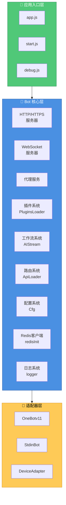
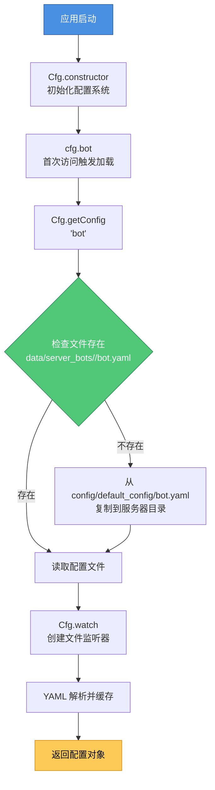
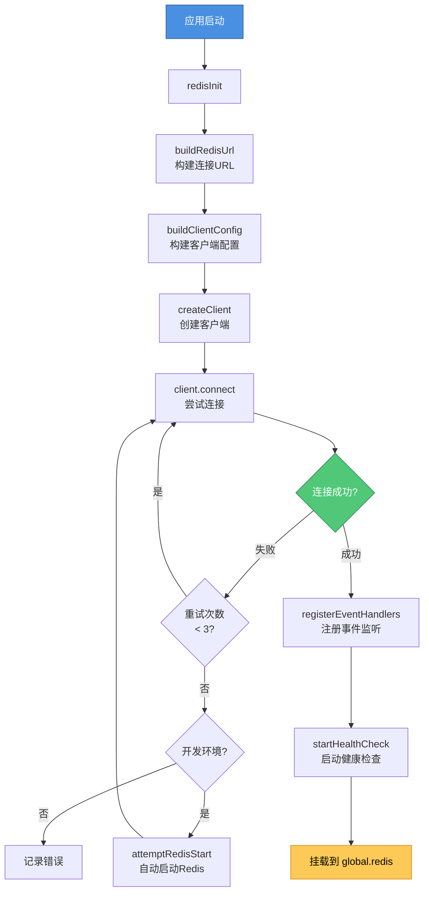
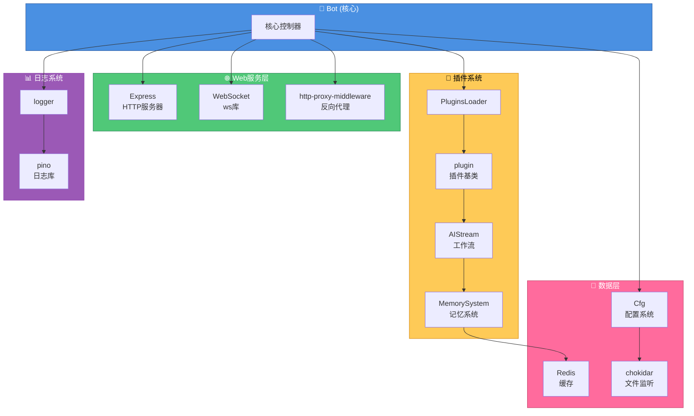

<h1 align="center">XRK-Yunzai 技术架构文档</h1>

<div align="center">


</div>

> 🏗️ 本文档详细说明 XRK-Yunzai 的技术栈架构、核心对象的作用与特性，以及它们在整个系统中的位置和关系。

---

<h2 align="center">1. 系统架构概览</h2>

XRK-Yunzai 采用 **事件驱动、模块化** 的架构设计，核心组件包括：



---

<h2 align="center">2. 核心对象与技术特性</h2>

> 对象 API 与用法详见 [CORE_OBJECTS.md](./CORE_OBJECTS.md) 与各 reference 文档。

### 2.1 Bot 对象 (`lib/bot.js`)

**作用**: 核心控制器，生命周期管理、事件分发、路由与 WS 注册、Proxy 暴露 BotUtil。

**关键方法**: `run(options)`、`prepareEvent(data)`、`em(name, data)`、`closeServer()`。详见 [BOT.md](./reference/BOT.md)。

---

### 2.2 事件对象 `e`

统一事件结构（OneBot/设备/STDIN），经 `Bot.prepareEvent` 与 PluginsLoader 注入 bot、friend、group、member、reply 等。详见 [CORE_OBJECTS.md](./CORE_OBJECTS.md#2-事件对象-e)。

### 2.3 配置 `cfg`、Redis、logger、plugin、AIStream

- **cfg** (`lib/config/config.js`): 单例、多端口隔离、chokidar 热更新；`cfg.bot`、`cfg.redis`、`cfg.setConfig()` 等。详见 [CONFIG_AND_REDIS.md](./reference/CONFIG_AND_REDIS.md)。
- **Redis**: `redisInit()`、`global.redis`；AI 记忆、限流、会话锁。详见 [CONFIG_AND_REDIS.md](./reference/CONFIG_AND_REDIS.md)。
- **logger** (`lib/config/log.js`): Pino、多级别、轮转与清理。详见 [LOGGER.md](./reference/LOGGER.md)。
- **plugin** (`lib/plugins/plugin.js`): 工作流调用、上下文、规则匹配。详见 [PLUGIN_BASE_CLASS.md](./PLUGIN_BASE_CLASS.md)、[PLUGINS.md](./reference/PLUGINS.md)。
- **AIStream** (`lib/aistream/aistream.js`): 对话、记忆、BM25、函数调用。详见 [WORKFLOW_BASE_CLASS.md](./WORKFLOW_BASE_CLASS.md)、[WORKFLOWS.md](./reference/WORKFLOWS.md)。

---

<h2 align="center">3. 数据流与事件流</h2>

### 3.1 消息处理流程

```mermaid
flowchart TD
    Start[用户消息] --> Adapter[适配器<br/>OneBot/Device/STDIN]
    Adapter --> Em[Bot.em<br/>'message', rawData]
    Em --> Prepare[Bot.prepareEvent<br/>注入 bot/friend/group/member]
    Prepare --> Deal[PluginsLoader.deal<br/>处理事件]
    Deal --> DealMsg[PluginsLoader.dealMsg<br/>解析消息、设置属性]
    DealMsg --> SetupReply[PluginsLoader.setupReply<br/>设置回复方法]
    SetupReply --> RunPlugins[PluginsLoader.runPlugins<br/>匹配并执行插件]
    RunPlugins --> PluginFnc[plugin[rule.fnc]<br/>插件处理函数]
    PluginFnc --> Reply[e.reply<br/>回复消息]
    Reply --> Send[适配器发送消息]
    
    style Start fill:#4a90e2,stroke:#2c5aa0,color:#fff
    style Adapter fill:#50c878,stroke:#2d8659,color:#fff
    style PluginFnc fill:#feca57,stroke:#d68910,color:#000
    style Send fill:#ff6b9d,stroke:#c44569,color:#fff
```

### 3.2 配置加载流程



### 3.3 Redis 初始化流程



---

<h2 align="center">4. 技术栈依赖关系</h2>



---

<h2 align="center">5. 扩展点与集成方式</h2>

### 5.1 适配器集成

```javascript
// 在 plugins/adapter/MyAdapter.js
export default class MyAdapter {
  constructor() {
    Bot.adapter.push(this);
    this.id = 'my-adapter';
    this.name = 'MyAdapter';
  }
  
  async handleMessage(data) {
    Bot.em('message', {
      self_id: data.bot_id,
      user_id: data.user_id,
      message: data.message
    });
  }
}
```

### 5.2 路由集成

```javascript
// 在 plugins/<插件根>/http/MyApi.js
export default {
  name: 'my-api',
  routes: [{
    method: 'GET',
    path: '/api/my-endpoint',
    handler: async (req, res, Bot) => {
      res.json({ success: true });
    }
  }]
};
```

### 5.3 插件开发

```javascript
// 在 plugins/MyPlugin.js
// 假设已导入: import plugin from '../../lib/plugins/plugin.js';

export default class MyPlugin extends plugin {
  constructor() {
    super({
      name: 'my-plugin',
      dsc: '我的插件',
      event: 'message',
      rule: [{ reg: '^#测试$', fnc: 'test' }]
    });
  }
  
  async test(e) {
    return this.reply('测试成功');
  }
}
```

---

<h2 align="center">6. 性能优化特性</h2>

1. **连接池**: Redis 连接池根据系统资源自动调整
2. **缓存机制**: 配置、工作流等使用内存缓存
3. **异步处理**: 日志、文件操作等使用异步API
4. **批量处理**: 插件批量加载，事件批量处理
5. **懒加载**: 配置、工作流按需加载
6. **节流控制**: 消息节流防止频繁触发

---

<h2 align="center">7. 安全特性</h2>

1. **API 认证**: API Key + 白名单 + 本地地址三层认证
2. **HTTPS 支持**: 支持 SSL/TLS 加密
3. **安全头**: Helmet 中间件提供安全HTTP头
4. **速率限制**: Express rate-limit 防止滥用
5. **输入验证**: 消息解析和验证
6. **权限控制**: 插件级别的权限检查

---

<h2 align="center">8. 相关文档</h2>

- [核心对象文档](./CORE_OBJECTS.md) - 详细的对象API说明
- [Bot对象手册](./reference/BOT.md) - Bot对象的完整方法
- [插件基类文档](./PLUGIN_BASE_CLASS.md) - 插件开发指南
- [工作流基类文档](./WORKFLOW_BASE_CLASS.md) - 工作流开发指南
- [工厂模式文档](./FACTORY.md) - LLM工厂模式和提供商管理
- [配置与Redis手册](./reference/CONFIG_AND_REDIS.md) - 配置和Redis使用
- [技术栈概览](./TECH_STACK.md) - 技术栈依赖和工具

