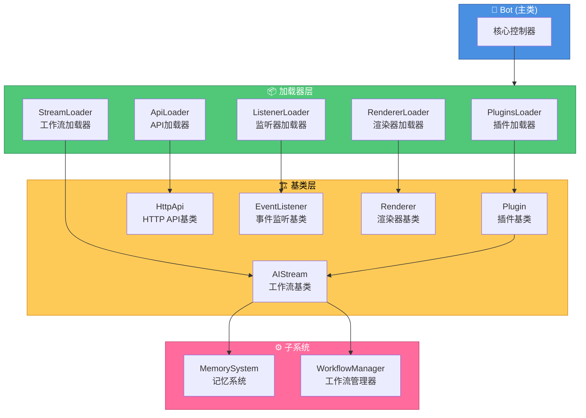

# 项目基类文档

本文档介绍 XRK-Yunzai 项目中的所有基类及其使用方法。

## 目录

- [工作流基类 (AIStream)](#工作流基类-aistream)
- [插件基类 (Plugin)](#插件基类-plugin)
- [HTTP API基类 (HttpApi)](#http-api基类-httpapi)
- [事件监听基类 (EventListener)](#事件监听基类-eventlistener)
- [渲染器基类 (Renderer)](#渲染器基类-renderer)
- [Bot主类](#bot主类)

## 详细文档

每个基类都有独立的详细开发文档：

- [工作流基类开发文档](./WORKFLOW_BASE_CLASS.md) - 如何创建自定义工作流
- [插件基类开发文档](./PLUGIN_BASE_CLASS.md) - 如何创建插件
- [HTTP API基类开发文档](./HTTP_API_BASE_CLASS.md) - 如何创建API路由

---

## 工作流基类 (AIStream)

**路径**: `lib/aistream/aistream.js`

所有AI工作流的基类，提供统一的AI调用、记忆系统、功能管理等能力。

### 核心特性

- **记忆系统**: 自动场景隔离的记忆管理
- **功能注册**: AI可以在回复中使用注册的功能
- **推理调优**: 支持多轮推理和响应润色
- **参数优先级**: execute传入 > 构造函数 > aistream配置/LLM提供商配置 > 默认值

**使用**：继承 `AIStream`，在构造函数中 `super({ name, description, version?, ... })`，实现 `buildSystemPrompt(context)` 与 `buildChatContext(e, question)`。工作流放 `plugins/<插件根>/stream/*.js`。

### 详细文档

- [工作流基类开发文档](./WORKFLOW_BASE_CLASS.md)

---

## 插件基类 (Plugin)

**路径**: `lib/plugins/plugin.js`

所有插件的基类，提供工作流集成、上下文管理、消息回复等功能。

### 核心特性

- **工作流集成**: 可以直接调用工作流
- **上下文管理**: 支持状态管理和超时控制
- **消息回复**: 简化的消息回复接口

**工作流方法**：`getStream(name)`、`callWorkflow(name, params, context)`、`callWorkflows(workflows, sharedParams, context)`（并行）、`callWorkflowsSequential(...)`（串行）、`executeWorkflow(streamName, question, config)`。完整示例见 [PLUGINS.md](./reference/PLUGINS.md)、[PLUGIN_BASE_CLASS.md](./PLUGIN_BASE_CLASS.md)。

---

## HTTP API基类 (HttpApi)

**路径**: `lib/http/http.js`

所有HTTP API模块的基类，提供路由注册、WebSocket处理等功能。

### 核心特性

- **路由注册**: 支持多种HTTP方法
- **WebSocket支持**: 可以注册WebSocket处理器
- **中间件支持**: 支持自定义中间件

**使用**: 对象导出 `{ name, dsc, routes, ws?, middleware? }` 或继承 `HttpApi`，文件放 `plugins/<插件根>/http/`。详见 [HTTP_API_BASE_CLASS.md](./HTTP_API_BASE_CLASS.md)。

---

## 事件监听基类 (EventListener)

**路径**: `lib/listener/listener.js`

事件监听器的基类，用于监听Bot事件。

### 核心特性

- **事件监听**: 监听指定的事件
- **插件集成**: 自动触发插件处理

**使用**: 继承 `EventListener`，实现 `execute(e)`，文件放 `plugins/<插件根>/events/`。

---

## 渲染器基类 (Renderer)

**路径**: `lib/renderer/Renderer.js`

图片渲染器的基类，用于将HTML模板渲染为图片。

### 核心特性

- **模板渲染**: 支持art-template模板
- **文件监听**: 自动监听模板文件变化
- **多渲染器支持**: 支持puppeteer和playwright

**使用**: 继承 `Renderer`，实现 `render(tpl, data)`，渲染器放 `renderers/`。

---

## Bot主类

**路径**: `lib/bot.js`

系统的核心类，负责HTTP服务器、WebSocket、插件管理、配置管理等。

### 核心特性

- **HTTP服务器**: Express应用和HTTP/HTTPS服务器
- **WebSocket支持**: WebSocket服务器和连接管理
- **插件管理**: 插件加载和执行
- **配置管理**: 配置加载和热重载
- **反向代理**: 支持多域名反向代理

**常用**：`Bot.run({ port })`、`Bot.sendFriendMsg`/`sendGroupMsg`/`sendMasterMsg`。完整 API 见 [BOT.md](./reference/BOT.md)。

### 路径

- **主类文件**: `lib/bot.js`
- **启动文件**: `app.js` -> `start.js`

---

## 基类关系图

---

## 快速参考

| 基类 | 路径 | 用途 |
|------|------|------|
| AIStream | `lib/aistream/aistream.js` | AI工作流基类 |
| Plugin | `lib/plugins/plugin.js` | 插件基类 |
| HttpApi | `lib/http/http.js` | HTTP API基类 |
| EventListener | `lib/listener/listener.js` | 事件监听基类 |
| Renderer | `lib/renderer/Renderer.js` | 渲染器基类 |
| Bot | `lib/bot.js` | Bot主类 |

---

## 相关文档

- [工作流基类开发文档](./WORKFLOW_BASE_CLASS.md)
- [工厂模式文档](./FACTORY.md) - LLM提供商管理
- [配置优先级文档](./CONFIG_PRIORITY.md) - 配置优先级说明
- [项目README](../README.md)

