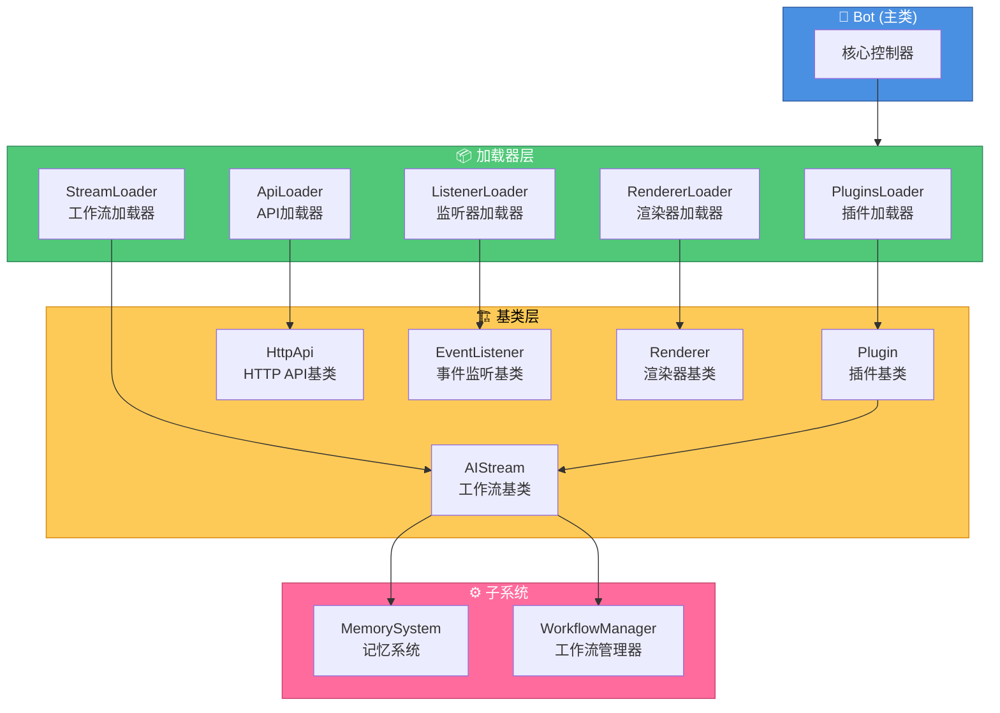

<h1 align="center">项目基类文档</h1>

<div align="center">


</div>

> 📚 本文档概览 XRK-Yunzai 中所有核心基类，并引导你跳转到各自的详细开发文档。

本文档介绍 XRK-Yunzai 项目中的所有基类及其使用方法。

## 目录

- [工作流基类 (AIStream)](#工作流基类-aistream)
- [插件基类 (Plugin)](#插件基类-plugin)
- [HTTP API基类 (HttpApi)](#http-api基类-httpapi)
- [事件监听基类 (EventListener)](#事件监听基类-eventlistener)
- [渲染器基类 (Renderer)](#渲染器基类-renderer)
- [Bot主类](#bot主类)

## 详细文档

每个基类都有独立的详细开发文档：

- [工作流基类开发文档](./WORKFLOW_BASE_CLASS.md) - 如何创建自定义工作流
- [插件基类开发文档](./PLUGIN_BASE_CLASS.md) - 如何创建插件
- [HTTP API基类开发文档](./HTTP_API_BASE_CLASS.md) - 如何创建API路由

---

## 工作流基类 (AIStream)

**路径**: `lib/aistream/aistream.js`

所有AI工作流的基类，提供统一的AI调用、记忆系统、功能管理等能力。

### 核心特性

- **记忆系统**: 自动场景隔离的记忆管理
- **功能注册**: AI可以在回复中使用注册的功能
- **推理调优**: 支持多轮推理和响应润色
- **参数优先级**: execute传入 > 构造函数 > aistream配置/LLM提供商配置 > 默认值

### 使用方法

```javascript
// 假设已导入: import AIStream from '../../lib/aistream/aistream.js';

export default class MyWorkflow extends AIStream {
  constructor() {
    super({
      name: 'myworkflow',
      description: '我的工作流',
      version: '1.0.0'
    });
  }

  buildSystemPrompt(context) {
    return '系统提示';
  }

  async buildChatContext(e, question) {
    return [
      { role: 'system', content: this.buildSystemPrompt({ e, question }) },
      { role: 'user', content: question }
    ];
  }
}
```

### 详细文档

- [工作流基类开发文档](./WORKFLOW_BASE_CLASS.md)

---

## 插件基类 (Plugin)

**路径**: `lib/plugins/plugin.js`

所有插件的基类，提供工作流集成、上下文管理、消息回复等功能。

### 核心特性

- **工作流集成**: 可以直接调用工作流
- **上下文管理**: 支持状态管理和超时控制
- **消息回复**: 简化的消息回复接口

### 工作流相关方法

```javascript
// 获取工作流实例
const stream = this.getStream('chat');

// 调用单个工作流
const result = await this.callWorkflow('chat', { question: '你好' });

// 同时调用多个工作流（并行）
const results = await this.callWorkflows([
  'chat',
  { name: 'file', params: { question: '创建test.txt' } }
], {}, { e: this.e });

// 顺序调用多个工作流（串行）
const results = await this.callWorkflowsSequential(['file', 'chat']);

// 直接执行工作流（简化）
const result = await this.executeWorkflow('chat', '你好');
```

### 完整示例

```javascript
// 假设已导入: import plugin from '../../lib/plugins/plugin.js';

export default class MyPlugin extends plugin {
  constructor() {
    super({
      name: 'my-plugin',
      dsc: '我的插件',
      event: 'message',
      priority: 5000,
      rule: [{ reg: '^#测试$', fnc: 'test' }]
    });
  }

  async test(e) {
    const result = await this.callWorkflow('chat', { question: e.msg }, { e });
    return this.reply(result);
  }
}
```

---

## HTTP API基类 (HttpApi)

**路径**: `lib/http/http.js`

所有HTTP API模块的基类，提供路由注册、WebSocket处理等功能。

### 核心特性

- **路由注册**: 支持多种HTTP方法
- **WebSocket支持**: 可以注册WebSocket处理器
- **中间件支持**: 支持自定义中间件

### 使用方法

```javascript
// 方式1: 使用对象导出（推荐）
export default {
  name: 'my-api',
  dsc: '我的API',
  priority: 100,
  routes: [{
    method: 'GET',
    path: '/api/test',
    handler: async (req, res, Bot) => {
      res.json({ success: true });
    }
  }],
  init: async (app, Bot) => {
    // 初始化逻辑
  }
};

// 方式2: 继承HttpApi类
// 假设已导入: import HttpApi from '../../lib/http/http.js';

export default class MyApi extends HttpApi {
  constructor() {
    super({ name: 'my-api', routes: [/* ... */] });
  }
}
```

### 路径

- **API文件**: `plugins/api/`
- **基类文件**: `lib/http/http.js`
- **加载器**: `lib/http/loader.js`

---

## 事件监听基类 (EventListener)

**路径**: `lib/listener/listener.js`

事件监听器的基类，用于监听Bot事件。

### 核心特性

- **事件监听**: 监听指定的事件
- **插件集成**: 自动触发插件处理

### 使用方法

```javascript
// 假设已导入: import EventListener from '../../lib/listener/listener.js';

export default class MyListener extends EventListener {
  constructor() {
    super({ prefix: 'my', event: 'message', once: false });
  }

  async execute(e) {
    this.plugins.deal(e);
  }
}
```

### 路径

- **监听器文件**: `plugins/events/`
- **基类文件**: `lib/listener/listener.js`
- **加载器**: `lib/listener/loader.js`

---

## 渲染器基类 (Renderer)

**路径**: `lib/renderer/Renderer.js`

图片渲染器的基类，用于将HTML模板渲染为图片。

### 核心特性

- **模板渲染**: 支持art-template模板
- **文件监听**: 自动监听模板文件变化
- **多渲染器支持**: 支持puppeteer和playwright

### 使用方法

```javascript
// 假设已导入: import Renderer from '../../lib/renderer/Renderer.js';

export default class MyRenderer extends Renderer {
  constructor() {
    super({ id: 'my-renderer', type: 'image', render: 'render' });
  }

  async render(tpl, data) {
    return await this.dealTpl('my-template', { tplFile: tpl, data });
  }
}
```

### 路径

- **渲染器文件**: `renderers/`
- **基类文件**: `lib/renderer/Renderer.js`
- **加载器**: `lib/renderer/loader.js`

---

## Bot主类

**路径**: `lib/bot.js`

系统的核心类，负责HTTP服务器、WebSocket、插件管理、配置管理等。

### 核心特性

- **HTTP服务器**: Express应用和HTTP/HTTPS服务器
- **WebSocket支持**: WebSocket服务器和连接管理
- **插件管理**: 插件加载和执行
- **配置管理**: 配置加载和热重载
- **反向代理**: 支持多域名反向代理

### 主要方法

```javascript
// 启动服务器
await Bot.run({ port: 2537 });

// 发送好友消息
await Bot.sendFriendMsg(bot_id, user_id, message);

// 发送群消息
await Bot.sendGroupMsg(bot_id, group_id, message);

// 发送主人消息
await Bot.sendMasterMsg(message);
```

### 路径

- **主类文件**: `lib/bot.js`
- **启动文件**: `app.js` -> `start.js`

---

## 基类关系图



---

## 快速参考

| 基类 | 路径 | 用途 |
|------|------|------|
| AIStream | `lib/aistream/aistream.js` | AI工作流基类 |
| Plugin | `lib/plugins/plugin.js` | 插件基类 |
| HttpApi | `lib/http/http.js` | HTTP API基类 |
| EventListener | `lib/listener/listener.js` | 事件监听基类 |
| Renderer | `lib/renderer/Renderer.js` | 渲染器基类 |
| Bot | `lib/bot.js` | Bot主类 |

---

## 相关文档

- [工作流基类开发文档](./WORKFLOW_BASE_CLASS.md)
- [工厂模式文档](./FACTORY.md) - LLM提供商管理
- [配置优先级文档](./CONFIG_PRIORITY.md) - 配置优先级说明
- [项目README](../README.md)

