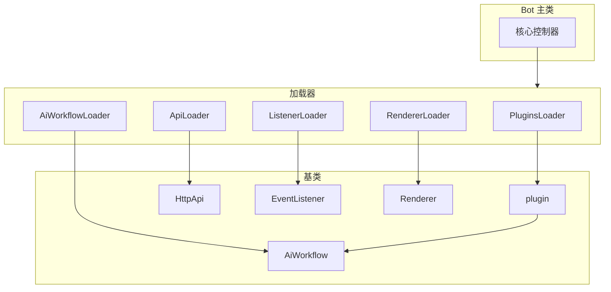

# 项目基类文档

> **首选短契约**：[base-classes.md](./base-classes.md) · **与 Yunzai / 多端口**：[VS_YUNZAI.md](./VS_YUNZAI.md)

## 目录

- [工作流基类 (AiWorkflow)](#工作流基类-aiworkflow)
- [插件基类 (Plugin)](#插件基类-plugin)
- [HTTP API基类 (HttpApi)](#http-api基类-httpapi)
- [事件监听基类 (EventListener)](#事件监听基类-eventlistener)
- [渲染器基类 (Renderer)](#渲染器基类-renderer)
- [Bot主类](#bot主类)

## 详细文档

- [WORKFLOW_BASE_CLASS.md](./WORKFLOW_BASE_CLASS.md)
- [PLUGIN_BASE_CLASS.md](./PLUGIN_BASE_CLASS.md)
- [HTTP_API_BASE_CLASS.md](./HTTP_API_BASE_CLASS.md)
- [COMMONCONFIG_BASE.md](./COMMONCONFIG_BASE.md)

---

## 工作流基类 (AiWorkflow)

**路径**: `lib/ai-workflow/ai-workflow.js`（[ext]）

所有 AI 工作流的基类：记忆、MCP/功能注册、LLM 调用。

**使用**：继承 `AiWorkflow`，`super({ name, description, … })`，实现 `buildSystemPrompt` / `buildChatContext`。文件放 `plugins/<名>/workflow/*.js`。

详见 [WORKFLOW_BASE_CLASS.md](./WORKFLOW_BASE_CLASS.md)、[AISTREAM_AND_MCP.md](./reference/AISTREAM_AND_MCP.md)。

---

## 插件基类 (Plugin)

**路径**: `lib/plugins/plugin.js`（compat + 工作流 ext）

**工作流方法**：`getWorkflow`、`callWorkflow`、`callWorkflows`、`callWorkflowsSequential`、`executeWorkflow`。见 [PLUGINS.md](./reference/PLUGINS.md)、[VS_YUNZAI.md](./VS_YUNZAI.md)。

---

## HTTP API基类 (HttpApi)

**路径**: `lib/http/http.js`（[ext]）

对象导出或 `extends HttpApi`；目录 `plugins/<名>/http/`。详见 [HTTP_API_BASE_CLASS.md](./HTTP_API_BASE_CLASS.md)。

---

## 事件监听基类 (EventListener)

**路径**: `lib/listener/listener.js`（[compat]）

`execute(e)` → `PluginsLoader.deal(e)`；目录 `plugins/<名>/events/`。

---

## 工厂基类 (BaseFactory)

**路径**: `lib/factory/BaseFactory.js`（[ext]）

LLM 等工厂的提供商注册与创建。
- **registerProvider**: 注册提供商工厂函数
- **createClient**: 子类实现，按 provider 创建客户端

**使用**: `LLMFactory` 继承此类。

---

## 配置基类 (ConfigBase)

**路径**: `lib/commonconfig/commonconfig.js`

CommonConfig 配置文件读写与 schema 校验基类。

### 核心特性

- **read / write**: YAML/JSON 配置读写与缓存
- **schema**: 构造阶段严格校验默认值与类型

**使用**: CommonConfig 注册项继承或在 `plugins/system-plugin/commonconfig/` 定义 schema。

---

## 渲染器基类 (Renderer)

**路径**: `lib/renderer/Renderer.js`

图片渲染器的基类，用于将HTML模板渲染为图片。

### 核心特性

- **模板渲染**: 支持art-template模板
- **文件监听**: 自动监听模板文件变化
- **多渲染器支持**: 支持puppeteer和playwright

**使用**: 继承 `Renderer`，实现 `render(tpl, data)`，渲染器放 `renderers/`。

---

## Bot主类

**路径**: `lib/bot.js`

系统的核心类，负责HTTP服务器、WebSocket、插件管理、配置管理等。

### 核心特性

- **HTTP服务器**: Express应用和HTTP/HTTPS服务器
- **WebSocket支持**: WebSocket服务器和连接管理
- **插件管理**: 插件加载和执行
- **配置管理**: 配置加载和热重载
- **反向代理**: 支持多域名反向代理

**启动**: `app.js` → `start.js` **选端口** → `Bot.run({ port })`。多端口与单端口多 Bot 见 [VS_YUNZAI.md](./VS_YUNZAI.md)。

**常用**：`Bot.run({ port })`、`Bot.sendFriendMsg`/`sendGroupMsg`/`sendMasterMsg`。完整 API 见 [BOT.md](./reference/BOT.md)。

---

## 基类关系图

```mermaid
graph TB
    subgraph BotNode["Bot 主类"]
        BotCore[核心控制器]
    end

    subgraph Loaders["加载器"]
        PluginLoader[PluginsLoader]
        AiWorkflowLoader[AiWorkflowLoader]
        ApiLoader[ApiLoader]
        ListenerLoader[ListenerLoader]
        RendererLoader[RendererLoader]
    end

    subgraph BaseClasses["基类"]
        Plugin[plugin]
        AiWorkflow[AiWorkflow]
        HttpApi[HttpApi]
        EventListener[EventListener]
        Renderer[Renderer]
    end

    BotCore --> Loaders
    PluginLoader --> Plugin
    AiWorkflowLoader --> AiWorkflow
    ApiLoader --> HttpApi
    ListenerLoader --> EventListener
    RendererLoader --> Renderer
    Plugin --> AiWorkflow
```

---

## 快速参考

| 基类 | 路径 | 相对 Yunzai |
|------|------|-------------|
| plugin | `lib/plugins/plugin.js` | compat |
| Handler | `lib/plugins/handler.js` | compat |
| EventListener | `lib/listener/listener.js` | compat |
| AiWorkflow | `lib/ai-workflow/ai-workflow.js` | **ext** |
| HttpApi | `lib/http/http.js` | **ext** |
| CommonConfig | `lib/commonconfig/commonconfig.js` | **ext** |
| Renderer | `lib/renderer/Renderer.js` | 有 |
| BaseFactory | `lib/factory/BaseFactory.js` | **ext** |
| HotReloadBase | `lib/utils/hot-reload-base.js` | **ext** |
| Bot | `lib/bot.js` | 扩展（多端口 `run({ port })`） |

---

## 相关文档

- [VS_YUNZAI.md](./VS_YUNZAI.md) — 多端口 / 基类对照
- [base-classes.md](./base-classes.md) — 短契约
- [WORKFLOW_BASE_CLASS.md](./WORKFLOW_BASE_CLASS.md)
- [FACTORY.md](./FACTORY.md)
- [CONFIG_PRIORITY.md](./CONFIG_PRIORITY.md)

