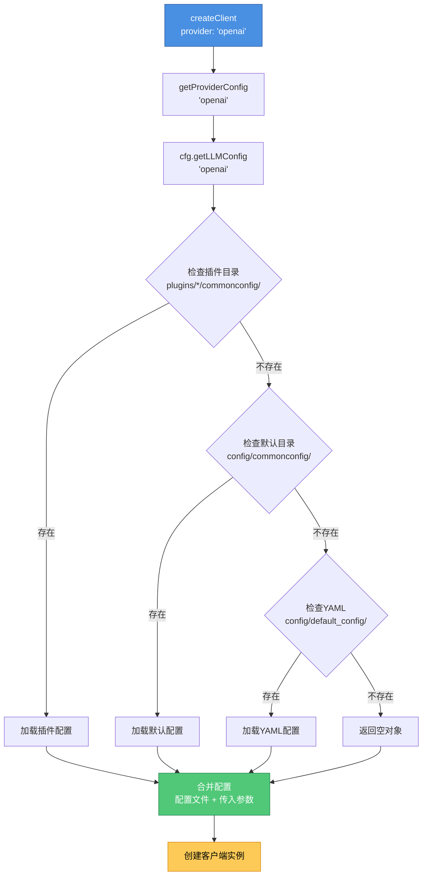

<h1 align="center">工厂模式文档</h1>

<div align="center">


</div>

> 🏭 本文档详细介绍 XRK-Yunzai 中的工厂模式实现，特别是 LLM（大语言模型）客户端的工厂模式。

---

## 📖 概述

XRK-Yunzai 使用工厂模式来管理多种 LLM 提供商的客户端创建。工厂模式的核心优势：

- **统一接口**：所有 LLM 提供商通过统一的接口创建和使用
- **易于扩展**：添加新的 LLM 提供商只需注册工厂函数
- **配置管理**：自动从配置系统读取提供商配置
- **动态选择**：运行时根据配置动态选择提供商

**文件路径**: `lib/factory/llm/LLMFactory.js`

---

## 🏗️ 架构设计

### 工厂模式结构

```
LLMFactory (工厂类)
├── providers (Map) - 提供商注册表
│   ├── gptgod → GPTGodLLMClient
│   ├── volcengine → VolcengineLLMClient
│   ├── openai → OpenAILLMClient
│   ├── gemini → GeminiLLMClient
│   ├── anthropic → AnthropicLLMClient
│   ├── azure_openai → AzureOpenAILLMClient
│   ├── openai_compat → OpenAICompatibleLLMClient
│   └── xiaomimimo → XiaomiMiMoLLMClient
└── 静态方法
    ├── registerProvider() - 注册提供商
    ├── listProviders() - 列出所有提供商
    ├── hasProvider() - 检查提供商是否存在
    ├── getProviderConfig() - 获取提供商配置
    ├── getDefaultProvider() - 获取默认提供商
    └── createClient() - 创建客户端实例
```

### 支持的提供商

| 提供商 | 客户端类 | 接口地址 | 说明 |
|--------|---------|---------|------|
| `gptgod` | `GPTGodLLMClient` | `https://api.gptgod.online/v1` | GPTGod 大语言模型，支持识图功能 |
| `volcengine` | `VolcengineLLMClient` | `https://ark.cn-beijing.volces.com/api/v3` | 火山引擎豆包大模型 |
| `xiaomimimo` | `XiaomiMiMoLLMClient` | `https://api.xiaomimimo.com/v1` | 小米 MiMo 大语言模型（仅文本） |
| `openai` | `OpenAILLMClient` | `https://api.openai.com/v1` | OpenAI Chat Completions |
| `gemini` | `GeminiLLMClient` | `https://generativelanguage.googleapis.com/v1beta` | Google Generative Language API |
| `openai_compat` | `OpenAICompatibleLLMClient` | 可自定义 | OpenAI 兼容第三方，可自定义 baseUrl/path/认证 |
| `anthropic` | `AnthropicLLMClient` | `https://api.anthropic.com` | Anthropic Claude Messages API |
| `azure_openai` | `AzureOpenAILLMClient` | 可自定义 | Azure OpenAI，deployment + api-version 体系 |

---

## 🔧 核心 API

### 1. registerProvider(name, factoryFn)

注册自定义 LLM 提供商。

```javascript
// 假设已导入: import LLMFactory from '../../lib/factory/llm/LLMFactory.js';
//            import MyCustomLLMClient from './MyCustomLLMClient.js';

LLMFactory.registerProvider('custom', (config) => {
  return new MyCustomLLMClient({
    baseUrl: config.baseUrl || 'https://api.custom.com/v1',
    apiKey: config.apiKey,
    ...config
  });
});
```

**参数：**
- `name` (string): 提供商名称（不区分大小写）
- `factoryFn` (Function): 工厂函数，接收 `config` 参数，返回 LLM 客户端实例

---

### 2. listProviders()

列出所有已注册的提供商。

```javascript
const providers = LLMFactory.listProviders();
// ['gptgod', 'volcengine', 'openai', 'gemini', ...]
```

**返回：** `Array<string>` 提供商名称列表

> **注意**: 以下示例中，假设已通过 `import LLMFactory from '../../lib/factory/llm/LLMFactory.js'` 导入工厂类。

---

### 3. hasProvider(name)

检查提供商是否存在。

```javascript
if (LLMFactory.hasProvider('openai')) {
  console.log('OpenAI 提供商已注册');
}
```

**参数：**
- `name` (string): 提供商名称

**返回：** `boolean` 是否存在

---

### 4. getProviderConfig(provider)

从配置管理器获取提供商配置。

```javascript
const config = LLMFactory.getProviderConfig('openai');
// {
//   enabled: true,
//   baseUrl: 'https://api.openai.com/v1',
//   apiKey: 'sk-...',
//   ...
// }
```

**参数：**
- `provider` (string): 提供商名称

**返回：** `Object` 配置对象

**说明：**
- 自动从 `cfg.getLLMConfig(provider)` 读取配置
- 如果读取失败，返回空对象 `{}`
- 配置来源：`config/commonconfig/*.js` 或 `config/default_config/*.yaml`

---

### 5. getDefaultProvider()

获取默认提供商（从第一个启用的提供商或 gptgod）。

```javascript
const defaultProvider = LLMFactory.getDefaultProvider();
// 'gptgod' 或第一个启用的提供商
```

**返回：** `string` 默认提供商名称

**逻辑：**
1. 遍历所有已注册的提供商
2. 返回第一个 `enabled !== false` 的提供商
3. 如果没有启用的提供商，返回 `'gptgod'` 作为兜底

---

### 6. createClient(config)

创建 LLM 客户端实例。

```javascript
// 方式1: 使用默认提供商
const client1 = LLMFactory.createClient();

// 方式2: 指定提供商
const client2 = LLMFactory.createClient({ provider: 'openai' });

// 方式3: 完整配置
const client3 = LLMFactory.createClient({
  provider: 'openai',
  baseUrl: 'https://api.openai.com/v1',
  apiKey: 'sk-...',
  model: 'gpt-4',
  temperature: 0.7
});
```

**参数：**

| 字段 | 类型 | 必填 | 默认值 | 说明 |
|------|------|------|--------|------|
| `provider` | `string` | 否 | `'gptgod'` | 提供商名称 |
| `baseUrl` | `string` | 否 | 从配置读取 | API 基础地址 |
| `apiKey` | `string` | 否 | 从配置读取 | API 密钥 |
| `model` | `string` | 否 | 从配置读取 | 模型名称 |
| `temperature` | `number` | 否 | 从配置读取 | 温度参数 |
| `maxTokens` | `number` | 否 | 从配置读取 | 最大 token 数 |
| `timeout` | `number` | 否 | 从配置读取 | 超时时间（毫秒） |
| 其他字段 | `any` | 否 | - | 其他 LLM 参数 |

**返回：** `Object` LLM 客户端实例

**配置合并优先级：**

1. **传入的 config 参数**（最高优先级）
2. **配置文件中的提供商配置**（`cfg.getLLMConfig(provider)`）
3. **默认值**

**错误处理：**

- 如果提供商不存在，抛出错误：`不支持的LLM提供商: ${provider}`
- 如果配置读取失败，记录警告日志，使用空配置

---

## 📝 使用示例

> **注意**: 以下示例中，假设已导入必要的模块：
> - `import LLMFactory from '../../lib/factory/llm/LLMFactory.js'`
> - `import AIStream from '../../lib/aistream/aistream.js'`
> - `import plugin from '../../lib/plugins/plugin.js'`

### 示例1: 在工作流中使用工厂

```javascript
export default class MyWorkflow extends AIStream {
  async callAI(messages, apiConfig = {}) {
    const client = LLMFactory.createClient({
      provider: apiConfig.provider || 'openai',
      ...apiConfig
    });
    return await client.chat(messages, apiConfig);
  }
}
```

### 示例2: 在插件中直接使用工厂

```javascript
export default class AIPlugin extends plugin {
  async chat(e) {
    const client = LLMFactory.createClient({
      provider: 'openai',
      model: 'gpt-4'
    });
    const response = await client.chat([
      { role: 'user', content: e.msg }
    ]);
    return this.reply(response);
  }
}
```

### 示例3: 注册自定义提供商

```javascript
// lib/factory/llm/MyCustomLLMClient.js
export default class MyCustomLLMClient {
  constructor(config) {
    this.config = config;
    this.endpoint = config.baseUrl + '/chat/completions';
  }
  
  async chat(messages, overrides = {}) {
    // 实现聊天逻辑
    const response = await fetch(this.endpoint, {
      method: 'POST',
      headers: {
        'Content-Type': 'application/json',
        'Authorization': `Bearer ${this.config.apiKey}`
      },
      body: JSON.stringify({
        messages,
        model: this.config.model,
        ...overrides
      })
    });
    
    const data = await response.json();
    return data.choices[0].message.content;
  }
  
  async chatStream(messages, onDelta, overrides = {}) {
    // 实现流式聊天逻辑
    // ...
  }
}

// 步骤2: 注册提供商（假设已导入必要的模块）
LLMFactory.registerProvider('my-custom', (config) => {
  return new MyCustomLLMClient(config);
});

// 步骤3: 使用
const client = LLMFactory.createClient({
  provider: 'my-custom',
  baseUrl: 'https://api.custom.com/v1',
  apiKey: 'your-key'
});
```

### 示例4: 动态选择提供商

```javascript
// 假设已导入: import cfg from '../../lib/config/config.js';

function createClientForUser(userId) {
  const userConfig = cfg.getUserConfig(userId);
  const provider = userConfig.preferredLLM || LLMFactory.getDefaultProvider();
  return LLMFactory.createClient({ provider, ...userConfig.llmConfig });
}
```

---

## 🔗 与配置系统的集成

### 配置读取流程



### 配置优先级

1. **传入的 config 参数**（最高优先级）
2. **配置文件中的提供商配置**
3. **默认值**

### 配置文件位置

提供商配置可以存放在以下位置：

1. **插件目录**（推荐）: `plugins/*/commonconfig/*_llm.js`
2. **默认目录**: `config/commonconfig/*_llm.js`
3. **Core目录**: `core/*/commonconfig/*_llm.js`

配置文件示例：

```javascript
// config/commonconfig/openai_llm.js
// 假设已导入: import ConfigBase from '../../lib/commonconfig/commonconfig.js';

export default class OpenAILLMConfig extends ConfigBase {
  constructor() {
    super({
      name: 'openai_llm',
      displayName: 'OpenAI LLM 配置',
      filePath: 'config/default_config/openai_llm.yaml',
      fileType: 'yaml',
      schema: {
        fields: {
          enabled: { type: 'boolean', default: false },
          baseUrl: { type: 'string', default: 'https://api.openai.com/v1' },
          apiKey: { type: 'string', default: '' },
          model: { type: 'string', default: 'gpt-3.5-turbo' },
          temperature: { type: 'number', default: 0.7 },
          maxTokens: { type: 'number', default: 2000 }
        }
      }
    });
  }
}
```

---

## 🎯 最佳实践

### 1. 提供商选择

- **开发环境**：使用 `gptgod` 或 `openai_compat`（兼容性好）
- **生产环境**：根据实际需求选择稳定的提供商
- **多提供商**：可以注册多个提供商，运行时动态选择

### 2. 配置管理

- **集中配置**：使用配置文件管理提供商配置，避免硬编码
- **环境隔离**：不同环境使用不同的配置文件
- **敏感信息**：API Key 等敏感信息不要提交到版本控制

### 3. 错误处理

```javascript
try {
  const client = LLMFactory.createClient({ provider: 'openai' });
  const response = await client.chat(messages);
} catch (error) {
  if (error.message.includes('不支持的LLM提供商')) {
    // 提供商不存在，使用默认提供商
    const client = LLMFactory.createClient();
    const response = await client.chat(messages);
  } else {
    console.error('LLM调用失败:', error);
  }
}
```

### 4. 扩展提供商

- **实现标准接口**：自定义客户端必须实现 `chat()` 和 `chatStream()` 方法
- **配置兼容**：支持标准的配置字段（`baseUrl`、`apiKey`、`model` 等）
- **错误处理**：提供清晰的错误信息
- **文档完善**：为新提供商编写使用文档

---

## 🔍 常见问题

### Q: 如何切换提供商？

A: 在创建客户端时指定 `provider` 参数：

```javascript
const client = LLMFactory.createClient({
  provider: 'gemini'  // 切换到 Gemini
});
```

### Q: 如何添加新的提供商？

A: 实现客户端类并注册：

```javascript
// 1. 实现客户端类
class MyLLMClient {
  constructor(config) { /* ... */ }
  async chat(messages) { /* ... */ }
  async chatStream(messages, onDelta) { /* ... */ }
}

// 2. 注册提供商
LLMFactory.registerProvider('my-llm', (config) => {
  return new MyLLMClient(config);
});
```

### Q: 配置从哪里读取？

A: 配置从 `cfg.getLLMConfig(provider)` 读取，来源包括：
- `config/commonconfig/*_llm.js`
- `config/default_config/*.yaml`
- 插件目录下的配置文件

### Q: 如何获取所有可用的提供商？

A: 使用 `LLMFactory.listProviders()`：

```javascript
const providers = LLMFactory.listProviders();
console.log(providers);
```

### Q: 默认提供商是什么？

A: 默认提供商是第一个启用的提供商，如果没有启用的提供商，则使用 `'gptgod'`。

---

## 📚 相关文档

- [工作流基类文档](./WORKFLOW_BASE_CLASS.md) - 工作流如何使用工厂创建 LLM 客户端
- [配置系统文档](./COMMONCONFIG_BASE.md) - 提供商配置如何管理
- [核心对象文档](./CORE_OBJECTS.md) - `cfg` 对象如何读取配置
- [技术架构文档](./ARCHITECTURE.md) - 工厂模式在系统架构中的位置

---

## 🎨 设计模式说明

### 工厂模式的优势

1. **解耦**：客户端创建逻辑与使用逻辑分离
2. **扩展性**：添加新提供商只需注册，无需修改现有代码
3. **统一管理**：所有提供商通过统一接口管理
4. **配置集中**：配置读取逻辑集中管理

### 与其他模式的关系

- **单例模式**：`LLMFactory` 使用静态方法，无需实例化
- **策略模式**：不同提供商可以看作不同的策略
- **依赖注入**：配置通过参数注入，便于测试

---

## 📝 更新日志

- **v3.1.3**: 初始版本，支持 8 种 LLM 提供商
- 支持自定义提供商注册
- 集成配置系统
- 自动配置合并
