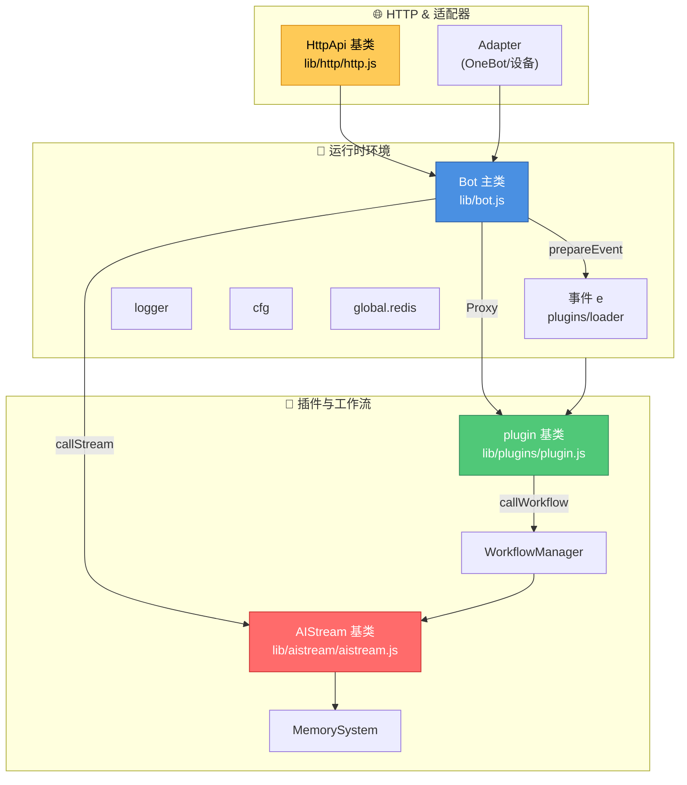

# XRK-Yunzai 开发者导航

<div align="center">


> 🎯 **目标**：一眼看清核心对象、基类与参考文档位置。此页作为 README 与子文档之间的"索引页"。

</div>

---

<div align="center">

## 📊 对象关系可视化

</div>

<div align="center">



</div>

---

## 📚 文档地图

<div align="center">

| 📖 分类 | 📄 文档 | 📝 内容摘要 |
|:---:|:---:|---|
| 🎯 **核心对象** | [`CORE_OBJECTS.md`](../CORE_OBJECTS.md) | `Bot` / 事件 `e` / `logger` / `cfg` / `segment` / `redis` |
| 🏗️ **技术架构** | [`ARCHITECTURE.md`](../ARCHITECTURE.md) | 系统架构、核心对象作用、数据流、技术栈依赖关系 |
| 🤖 **Bot API** | [`reference/BOT.md`](../reference/BOT.md) | 生命周期、HTTP/HTTPS/代理、好友/群、消息工具、WS |
| ⚡ **工作流** | [`reference/WORKFLOWS.md`](../reference/WORKFLOWS.md) | `AIStream` 全部方法、Embedding、MemorySystem、WorkflowManager |
| 🔌 **插件基类** | [`reference/PLUGINS.md`](../reference/PLUGINS.md) | 构造、规则、上下文管理、工作流调用、渲染 |
| 🌐 **HTTP 基类** | [`reference/HTTP.md`](../reference/HTTP.md) | REST/WS 注册、middleware、热重载 |
| ⚙️ **配置/Redis** | [`reference/CONFIG_AND_REDIS.md`](../reference/CONFIG_AND_REDIS.md) | `cfg` getters、watcher、Redis 初始化/事件 |
| 📊 **Logger 手册** | [`reference/LOGGER.md`](../reference/LOGGER.md) | `logger` 全部方法、颜色工具、格式化、计时器等 |
| 🔗 **适配器 & 路由** | [`reference/ADAPTER_AND_ROUTING.md`](../reference/ADAPTER_AND_ROUTING.md) | 适配器与路由系统如何与Bot交互、完整方法列表 |
| 🛠️ **技术栈** | [`TECH_STACK.md`](../TECH_STACK.md) | Node 运行时、Web 服务、缓存、DevOps |

</div>

---

## 🚀 开发流程指北

<div align="left">

### 1️⃣ 扩展 Bot 行为

```javascript
// 在 lib/bot.js 添加方法后
// 同步更新 docs/reference/BOT.md
```

- ✅ 在 `lib/bot.js` 添加方法后，同步更新 `docs/reference/BOT.md`
- ✅ 确保 README 导航能跳转到最新章节

### 2️⃣ 编写插件

```javascript
import plugin from '../../lib/plugins/plugin.js';

export default class MyPlugin extends plugin {
  constructor() {
    super({
      name: 'my-plugin',
      event: 'message',
      rule: [{ reg: '^#测试$', fnc: 'test' }]
    });
  }
  
  async test(e) {
    // 调用工作流
    const result = await this.callWorkflow('chat', { question: '你好' });
    return this.reply(result);
  }
}
```

- 📌 继承 `plugin`，配置 `rule` 与 `event`
- 🤖 如需 AI 能力，调用 `callWorkflow` 或 `executeWorkflow`
- 💬 多轮对话：使用 `setContext / awaitContext / finish`

### 3️⃣ 创建工作流

```javascript
import AIStream from '../../lib/aistream/aistream.js';

export default class MyWorkflow extends AIStream {
  constructor() {
    super({
      name: 'my-workflow',
      description: '我的工作流'
    });
  }
  
  buildSystemPrompt() {
    return '你是一个助手';
  }
}
```

- 📝 继承 `AIStream`，实现 `buildSystemPrompt` 与 `buildChatContext`
- 🔧 通过 `registerFunction` 暴露插件可调用的指令
- 🧠 若需记忆或语义检索，开启 `embeddingConfig` 并使用 `MemorySystem`

### 4️⃣ 暴露 HTTP/WS

```javascript
export default {
  name: 'my-api',
  routes: [{
    method: 'GET',
    path: '/api/test',
    handler: async (req, res) => {
      res.json({ success: true });
    }
  }]
};
```

- 🌐 在 `plugins/api/` 新增 `HttpApi` 子类或对象
- 📡 使用 `routes` 声明 REST，`ws` 注册长链接

### 5️⃣ 配置与部署

- ⚙️ 所有 YAML 修改建议通过 `cfg.setConfig` 写入，保留热加载
- 🔴 Redis 连接及健康检查逻辑在 `lib/config/redis.js`，可根据环境扩展

</div>

---

## 🔧 常见扩展入口

<div align="left">

| 🎯 扩展类型 | 📁 路径 | 📖 参考示例 |
|:---:|---|:---:|
| **🔌 Adapter** | `plugins/adapter/*` | `OneBotv11.js` - 将第三方协议注入 `Bot` |
| **🎨 渲染器** | `renderers/puppeteer`<br/>`renderers/playwright` | 可新增自定义渲染流程 |
| **📱 设备工作流** | `plugins/stream/device.js` | 结合 `plugins/api/device.js` 与事件 `e.isDevice` |

</div>

---

<div align="center">

> 💡 **提示**：如需进一步细化某一类函数，可在 `docs/reference/` 目录补充新文件，并在本导航中添加条目。

</div>

