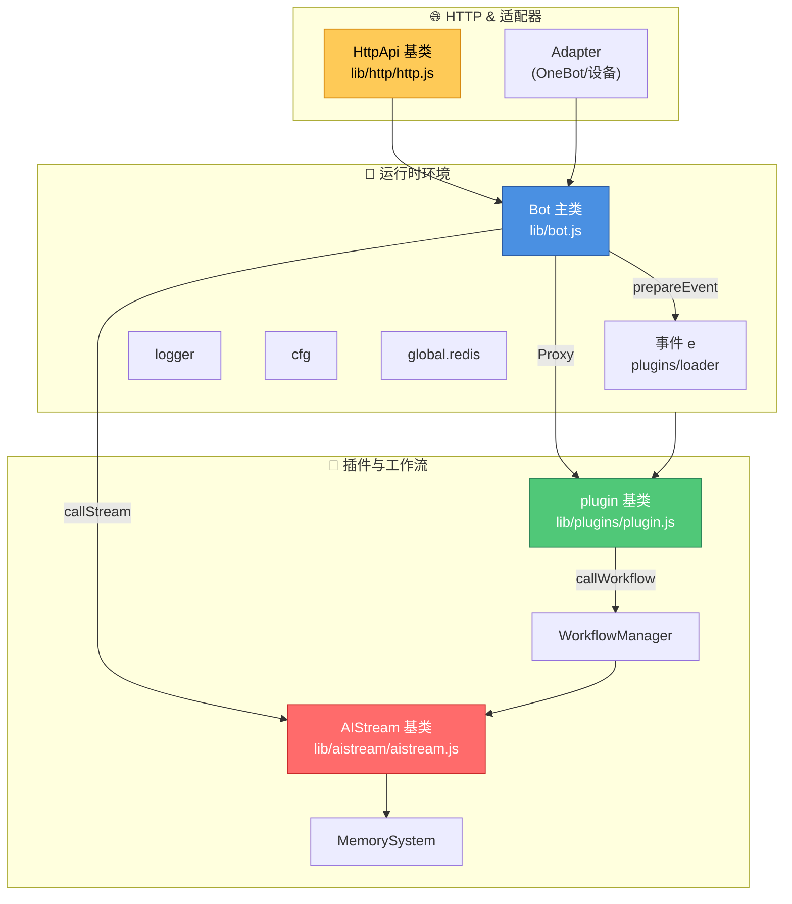

<h1 align="center">XRK-Yunzai 开发者导航</h1>

<div align="center">


</div>

> 🎯 **目标**：一眼看清核心对象、基类与参考文档位置。此页作为 README 与子文档之间的"索引页"。

---

<h2 align="center">📊 对象关系可视化</h2>


```mermaid
flowchart TB
    subgraph Runtime["🔧 运行时环境"]
        Bot["Bot 主类<br/>lib/bot.js"]
        Event["事件 e<br/>plugins/loader"]
        Logger["logger"]
        Cfg["cfg"]
        Redis["global.redis"]
    end

    subgraph Plugins["🔌 插件与工作流"]
        PluginBase["plugin 基类<br/>lib/plugins/plugin.js"]
        WorkflowBase["AIStream 基类<br/>lib/aistream/aistream.js"]
        WorkflowManager["WorkflowManager"]
        MemorySystem["MemorySystem"]
    end

    subgraph HTTP["🌐 HTTP & 适配器"]
        HttpApi["HttpApi 基类<br/>lib/http/http.js"]
        Adapter["Adapter<br/>(OneBot/设备)"]
    end

    Bot -->|prepareEvent| Event
    Bot -->|Proxy| PluginBase
    Bot -->|callStream| WorkflowBase
    PluginBase -->|callWorkflow| WorkflowManager
    WorkflowManager --> WorkflowBase
    WorkflowBase --> MemorySystem
    HttpApi --> Bot
    Adapter --> Bot
    Runtime --> PluginBase
    
    style Bot fill:#4a90e2,stroke:#2c5aa0,color:#fff
    style PluginBase fill:#50c878,stroke:#2d8659,color:#fff
    style WorkflowBase fill:#ff6b6b,stroke:#c92a2a,color:#fff
    style HttpApi fill:#feca57,stroke:#d68910,color:#000
```

---

<h2 align="center">📚 文档地图</h2>

| 📖 分类 | 📄 文档 | 📝 内容摘要 |
|:---:|:---:|---|
| 🎯 **核心对象** | [`CORE_OBJECTS.md`](../CORE_OBJECTS.md) | `Bot` / 事件 `e` / `logger` / `cfg` / `segment` / `redis` |
| 🏗️ **技术架构** | [`ARCHITECTURE.md`](../ARCHITECTURE.md) | 系统架构、核心对象作用、数据流、技术栈依赖关系 |
| 🤖 **Bot API** | [`reference/BOT.md`](../reference/BOT.md) | 生命周期、HTTP/HTTPS/代理、好友/群、消息工具、WS |
| ⚡ **工作流** | [`reference/WORKFLOWS.md`](../reference/WORKFLOWS.md) | `AIStream` 全部方法、MemorySystem、WorkflowManager |
| 🔌 **插件基类** | [`reference/PLUGINS.md`](../reference/PLUGINS.md) | 构造、规则、上下文管理、工作流调用、渲染 |
| 🌐 **HTTP 基类** | [`reference/HTTP.md`](../reference/HTTP.md) | REST/WS 注册、middleware、热重载 |
| ⚙️ **配置/Redis** | [`reference/CONFIG_AND_REDIS.md`](../reference/CONFIG_AND_REDIS.md) | `cfg` getters、watcher、Redis 初始化/事件 |
| 📊 **Logger 手册** | [`reference/LOGGER.md`](../reference/LOGGER.md) | `logger` 全部方法、颜色工具、格式化、计时器等 |
| 🔗 **适配器 & 路由** | [`reference/ADAPTER_AND_ROUTING.md`](../reference/ADAPTER_AND_ROUTING.md) | 适配器与路由与 Bot 的交互、事件流与协作；Bot 方法见 BOT.md |
| 🛠️ **技术栈** | [`TECH_STACK.md`](../TECH_STACK.md) | Node 运行时、Web 服务、缓存、DevOps |

---

<h2 align="center">🚀 开发流程指北</h2>

### 1️⃣ 扩展 Bot 行为

```javascript
// 在 lib/bot.js 添加方法后
// 同步更新 docs/reference/BOT.md
```

- ✅ 在 `lib/bot.js` 添加方法后，同步更新 `docs/reference/BOT.md`
- ✅ 确保 README 导航能跳转到最新章节

### 2️⃣ 编写插件

```javascript
import plugin from '../../lib/plugins/plugin.js';

export default class MyPlugin extends plugin {
  constructor() {
    super({
      name: 'my-plugin',
      event: 'message',
      rule: [{ reg: '^#测试$', fnc: 'test' }]
    });
  }
  
  async test(e) {
    // 调用工作流
    const result = await this.callWorkflow('chat', { question: '你好' });
    return this.reply(result);
  }
}
```

- 📌 继承 `plugin`，配置 `rule` 与 `event`
- 🤖 如需 AI 能力，调用 `callWorkflow` 或 `executeWorkflow`
- 💬 多轮对话：使用 `setContext / awaitContext / finish`

### 3️⃣ 创建工作流

```javascript
import AIStream from '../../lib/aistream/aistream.js';

export default class MyWorkflow extends AIStream {
  constructor() {
    super({
      name: 'my-workflow',
      description: '我的工作流'
    });
  }
  
  buildSystemPrompt() {
    return '你是一个助手';
  }
}
```

- 📝 继承 `AIStream`，实现 `buildSystemPrompt` 与 `buildChatContext`
- 🌐 **推荐方式**：在插件目录下创建 `stream/` 子目录（如 `plugins/myplugin/stream/workflow.js`）
- 🔧 通过 `registerFunction` 暴露插件可调用的指令
- 🧠 若需记忆摘要等，使用 `MemorySystem` 与 `buildMemorySummary`，或在子类中重写 `buildEnhancedContext`
- 📖 详见 [`WORKFLOW_BASE_CLASS.md`](../WORKFLOW_BASE_CLASS.md)

### 4️⃣ 暴露 HTTP/WS

```javascript
export default {
  name: 'my-api',
  routes: [{
    method: 'GET',
    path: '/api/test',
    handler: async (req, res) => {
      res.json({ success: true });
    }
  }]
};
```

- 🌐 **推荐方式**：在插件目录下创建 `http/` 子目录（如 `plugins/myplugin/http/api.js`）
- 📖 详见 [`HTTP_API_BASE_CLASS.md`](../HTTP_API_BASE_CLASS.md)
- 📡 使用 `routes` 声明 REST，`ws` 注册长链接

### 5️⃣ 配置与部署

- ⚙️ 所有 YAML 修改建议通过 `cfg.setConfig` 写入，保留热加载
- 🔴 Redis 连接及健康检查逻辑在 `lib/config/redis.js`，可根据环境扩展

</div>

---

<h2 align="center">🔧 常见扩展入口</h2>

| 🎯 扩展类型 | 📁 路径 | 📖 参考示例 |
|:---:|---|:---:|
| **🔌 Adapter** | `plugins/system-plugin/adapter/` | `OneBotv11.js`、`stdin.js` - 将协议注入 `Bot` |
| **🎨 渲染器** | `renderers/puppeteer`<br/>`renderers/playwright` | 可新增自定义渲染流程 |

---

> 💡 **提示**：如需进一步细化某一类函数，可在 `docs/reference/` 目录补充新文件，并在本导航中添加条目。
